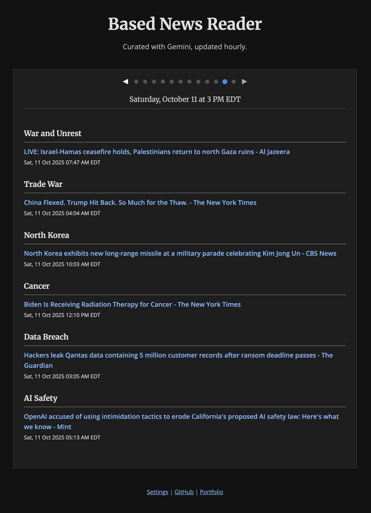

# Based News Reader

This project is a fully automated news digest web app. It fetches headlines from Google News, uses Google's Gemini AI to intelligently select and rank them based on user preferences, and serves the content from a live database. The entire process is hosted on Railway, with a scheduled worker process that updates the news hourly.

View the demo: **[news.blakerayvid.com](https://news.blakerayvid.com)**

---

## Key Features & How It Works

*   **Configurable via Google Sheets:** Easily manage topics, keywords, banned terms, and application parameters by copying and editing a [Google Sheet](https://docs.google.com/spreadsheets/d/1OjpsQEnrNwcXEWYuPskGRA5Jf-U8e_x0x3j2CKJualg/edit?usp=sharing).
*   **Intelligent Curation with Gemini:** A carefully engineered prompt instructs the Gemini AI to perform aggressive cross-topic deduplication, filter out low-quality content, and prioritize headlines based on user-defined weights.
*   **Dynamic Web Application:**
    *   The backend is a lightweight Flask web server that queries a PostgreSQL database for news content.
    *   The server-side rendering of the initial page ensures fast load times.
    *   Historical digests are lazy-loaded on demand via API calls, keeping the initial page load minimal.
*   **Automated Content Updates:** A scheduled worker process (`digest.py`) runs hourly on Railway, fetching fresh news and populating the database without requiring any code deployments.
*   **Interactive Frontend:**
    *   The frontend is pure, dependency-free HTML, CSS, and vanilla JavaScript.
    *   A swipeable/clickable slider allows users to seamlessly browse through historical digests.

## Tech Stack

*   **Backend:** Python 3, Flask
*   **AI:** Google Gemini API (`gemini-2.5-flash-lite`)
*   **Database:** PostgreSQL
*   **Data/NLP:** `requests`, `nltk`
*   **Frontend:** HTML5, CSS3, Vanilla JavaScript (with Jinja2 templating)
*   **Configuration:** Google Sheets (published as CSV)
*   **Hosting & Automation:** Railway (for web server, worker, and database)

---

## Directory Structure

```plaintext
based-news/
├── digest.py                   # Scheduled worker script for fetching news
├── Procfile                    # Defines processes for hosting (e.g., web, worker)
├── README.md                   # This file
├── requirements.txt            # Python dependencies for the worker
└── web/
    ├── app.py                  # Flask web server
    ├── railway.json            # Railway deployment configuration
    ├── requirements.txt        # Python dependencies for the web server
    ├── static/                 
    │   └── favicon.ico         # Static assets like the application icon 
    └── templates/
        └── index.html          # Jinja2 template for the main page
```

---

## Local Development

1.  **Clone** your forked repository.
2.  **Create and activate** a Python virtual environment.
3.  **Install dependencies:** `pip install -r requirements.txt` and `pip install -r web/requirements.txt`.
4.  **Create a `.env` file** with your `GEMINI_API_KEY` and the `DATABASE_URL` from your Railway project.
5.  **Run the worker** to populate the database: `python digest.py`.
6.  **Run the web server** to view the site: `python web/app.py` and navigate to `http://localhost:5000`.

---

<br>

