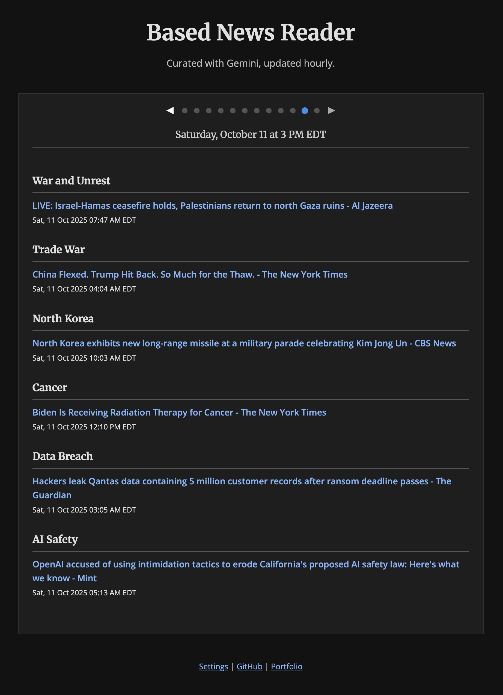

# Based News Reader

This project is a fully automated news digest and market intelligence web app. It fetches headlines from Google News, uses Google's Gemini AI to intelligently select and rank them based on user preferences, and serves the content from a live database.

The entire process is hosted on Railway, with a scheduled worker that update the news and generate market predictions automatically.

View the demo: **[news.blakerayvid.com](https://news.blakerayvid.com)**

---

## Key Features & How It Works

*   **Configurable via Google Sheets:** Easily manage topics, keywords, banned terms, and application parameters by copying and editing a [Google Sheet](https://docs.google.com/spreadsheets/d/1OjpsQEnrNwcXEWYuPskGRA5Jf-U8e_x0x3j2CKJualg/edit?usp=sharing).
*   **Intelligent Curation with Gemini:** A carefully engineered prompt instructs the Gemini AI to perform aggressive cross-topic deduplication, filter out low-quality content, and prioritize headlines based on user-defined weights.
*   **Dynamic Web Application:**
    *   The backend is a lightweight Flask web server that queries a PostgreSQL database.
    *   Server-side rendering ensures fast load times, while historical data is lazy-loaded on demand.
*   **Automated Content Updates:**
    *   `digest.py`: Runs hourly to fetch and curate fresh news.
*   **Interactive Frontend:**
    *   Pure HTML, CSS, and vanilla JavaScript (dependency-free).
    *   Includes swipeable carousels for browsing past digests and market forecasts.

## Tech Stack

*   **Backend:** Python 3, Flask
*   **AI & ML:** 
    *   Google Gemini API (`gemini-2.5-flash-lite`)
    *   `pandas`, `numpy`
*   **Database:** PostgreSQL
*   **Frontend:** HTML5, CSS3, Vanilla JavaScript, Jinja2, `Chart.js`
*   **Hosting & Automation:** Railway (Web Service + Cron Jobs)

---

## Directory Structure

```plaintext
based-news/
├── digest.py                   # Worker script for fetching/curating news
├── Procfile                    # Defines processes for hosting
├── README.md                   # This file
├── requirements.txt            # Python dependencies for the worker
└── web/
    ├── app.py                  # Flask web server
    ├── railway.json            # Railway deployment configuration
    ├── requirements.txt        # Python dependencies for the web server
    ├── static/                 
    │   └── favicon.ico         
    └── templates/
        ├── index.html          # Template for the news digest
        └── forecast.html       # Template for the market forecast
```

---

## Local Development

1.  **Clone** your forked repository.
2.  **Create and activate** a Python virtual environment.
3.  **Install dependencies:** `pip install -r requirements.txt` and `pip install -r web/requirements.txt`.
4.  **Create a `.env` file** with your `GEMINI_API_KEY` and the `DATABASE_URL` from your Railway project.
5.  **Run the news digest worker:** `python digest.py`.
6.  **Run the forecast engine:** `python forecast/engine.py`.
7.  **Run the web server** to view the site: `python web/app.py` and navigate to `http://localhost:5000`.

---

<br>



---
<p align="center">&copy; Copyright 2026 <a href="https://blakerayvid.com">Blake Rayvid</a>. All rights reserved.</p>